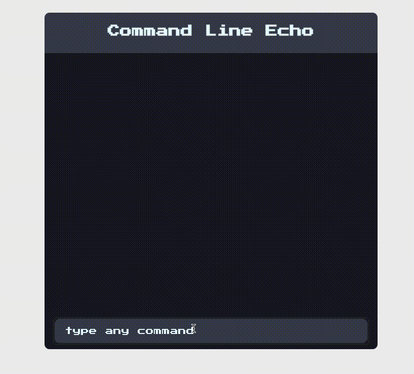

# 為替変換 CLI

## Description
CLI風の為替変換アプリです。
'ct' [command] [arg1] [arg2] の形で入力をして値を出力します。

command
 - showAvailableLocales
   - 利用可能な国を出力します。
 - showDominations [country]
   - 指定した国で使用できる通貨の単位を出力します。
 - convert [domination] [amountMoney] [domination]
    - 元の単位とお金の量、変換したい単位を受け取り変換した値を出力します。
#### ex
 `ct showAvailableLocales`

 `ct showDominations USA`

 `ct convert Dollar 10000 Euro`

- MVCに沿った設計。
- Validationを分けて設定。

## Stacks
 - TypeScript 4.4.2
 - NES.css [link](https://nostalgic-css.github.io/NES.css/)
  
## Demo

## URL
[為替変換 CLI]()

## Author
[@soylove2](https://twitter.com/soylove2)
